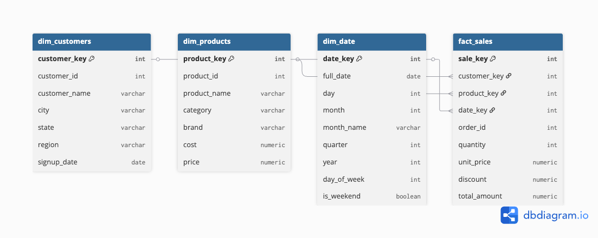

# Mini Data Warehouse de Vendas com PostgreSQL

Projeto de portfólio para construir um mini **Data Warehouse** em **PostgreSQL** usando **dimensional modeling (Star Schema)**.

## Objetivos
- Modelar um cenário de vendas (e-commerce) em **modelo estrela**
- Criar tabelas dimensionais e tabela fato
- Desenvolver queries analíticas (OLAP)
- Documentar o projeto como em ambiente corporativo

## Stack
- PostgreSQL
- SQL
- Python (para geração de dados sintéticos)

## Estrutura do repositório
- `data/raw/`: dados brutos (CSV)
- `data/staging/`: camada staging (intermediária)
- `sql/`: scripts SQL (DDL, cargas, transformações, análises)
- `docs/`: documentação técnica
- `scripts/`: scripts auxiliares (ex: geração de dados)
- `images/`: diagramas e screenshots

## Diagrama

## Perguntas
1) Qual é a granularidade da tabela fato?
2) Por que utilizar Star Schema?
3) Qual a diferença entre tabela fato e dimensão?
4)  